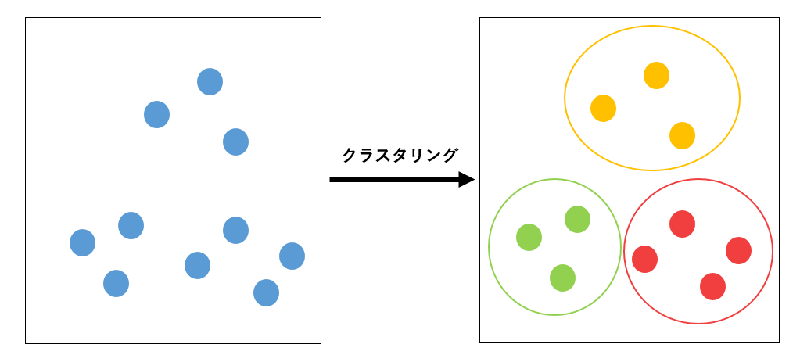

<!-- _class: first -->

# 「ベイズ推論による機械学習」輪読会

## 第 1 章: 機械学習とベイズ学習

### 正好 奏斗(@cosnomi)

---

## この章で扱うこと

- そもそも機械学習って何？
  - 具体的にはどんな種類・タスクがあるの？
- 確率の基本
  - コインとか赤玉白玉とか
- ベイズ推論
  - ベイズの基本で重要な考え方
  - 事前分布・事後分布って何？

---

## 機械学習とは

- データの特徴を抽出する
- その特徴に基づいて未知の現象に対する予測を行う

- 特徴
  - 例えば「比例関係」「一次関数」など
  - 比例定数や切片を既知のデータから推測
    - このような値をパラメータという
  - 未知のデータ(x)が与えられたら y を予測できる
  - 実際はもっと複雑な関数

---

### ここからは具体的な機械学習について見ていきます

- 1 つ 1 つを詳しく理解する必要は無いと思います
- 全体を俯瞰するのがこの章の目的

---

## 線形回帰とは

- <strong>回帰(regression)</strong>とは $M$ 次元の入力$\bm{x} = (x_1, ..., x_M) \in \mathbb{R}^M$から$y\in \mathbb{R}$を求めること
- $M=1$なら$y=wx+b$とか ($y, w, x, b \in \mathbb{R}$)
- 既知のデータ
  - $\bm{x}$も$y$も分かっているデータ
- 未知のデータ
  - $\bm{x}$は分かるが、$y$が分からないので予測したい

---

## 線形回帰の式

- 一般化すると、
  $$y=w_1x_1+w_2x_2+\dots+w_Mx_M$$
- という式の$\bm{w} = (w_1, w_2, ..., w_M) \in \mathbb{R}^M$を既知のデータから求めたい
- ベクトルで書くと、
  $$y=\bm{w}^T\bm{x}$$
- 内積を転置で表していることに注意
  - $\bm{a}\cdot \bm{b} = \bm{a}^T\bm{b}$

---

- しかし既知のデータもすべて綺麗にこの式に従うわけではない
- 各サンプル(既知のデータのこと)の$n$番目について次のような式を考えられる
  $$ y_n = \bm{w}^T\bm{x}_n + \epsilon_n$$
- $\epsilon$が$n$番目のサンプルの<strong>誤差</strong>あるいは<strong>ノイズ</strong>を表している

  - 多くの場合、$\epsilon$は正規分布に従う(が、その話は後で)

- 切片は？2 次以上は考えられないの？
  - $\bm{x}=(1, x_1, {x_1}^2, x_2, {x_2}^2,...)$などとしてやれば良い
  - これはグラフだと曲線になるけど「線形回帰」という

---

## どうやって w を学習させるの？

- 詳しくはあとでやりますが…
- 代表的なのは最小二乗法
  - 既知のデータについて 2 乗誤差が最小になるような$\bm{w}$を求める
  - (しかし、これは「ベイズ的」ではない…)
  - (ベイズ推論はもっと面白い方法で良い$\bm{w}$を求める)

---

## 回帰から分類へ

- <strong>分類(classification)</strong>も機械学習においてよく出てくるタスク
  - $y \in \{0, 1\}$のように離散的な値を取る
  - 例えば 0 が陰性、1 が陽性みたいな
  - 多クラス(0: 陰性, 1: 軽症, 2: 重症みたいな)は後で
- 線形回帰では連続値$y$を予測した
  - 離散的な値はどう予測する？

---

## 連続値を確率とみなす

- 回帰で求めた値($\mu_n$とします)は実数全体を取りうるのでややこしい
- $f: \mathbb{R} \rightarrow (0,1)$みたいな関数によって$\mu_n$を$(0,1)$に移せれば簡単
- $\mu$を「クラス 1 に分類される確率」として考えられる
  - $f(\mu)\geq 0.5$なら$y_n=1$、そうでないなら$y_n=0$とすればよい
- どんな関数が良いだろう…

---

## Sigmoid function

- 有名な関数: <strong>シグモイド関数(sigmoid function)</strong>
  $$ \mathrm{Sig}(a) = \frac{1}{1+e^{-a}}$$
- $\sigma(a)$とか表記されることもある

---

## ここまでを数式でまとめる

- 今やりたいのは
  - 入力$\bm{x}_n=(x_1, x_2, ... x_M)$が与えられて
  - 出力$y_n \in \{0, 1\}$を求めたい
- 線形回帰
  $$ \mu_n = \bm{w}^T\bm{x_n}$$
- 既知のデータから良い感じの$\bm{w}$を求めて、未知のデータにも適用
- $\mathrm{Sig}(\mu_n)$をとって、0.5 以上なら 1、そうでないなら 0

---

## 多クラス分類

- 0: 陰性, 1: 軽症, 2: 重症 みたいな分類をしたい
- 非医学で言えば、手書き数字の認識(MNIST)などが有名
- 各クラスごとの確率を出す
  - 先ほどの例では、最終的な出力は「クラス 1 に分類される確率」
  - k クラス分類では出力を$k$次元として、$i (1 \leq i \leq k)$番目の成分が「クラス$i$に分類される確率」を表すことにする
  - 「ことにする」 = そのようにモデルを train する

---

## softmax 関数

$$ f_k(\bm{a}) = \mathrm{SM}_k(\bm{a}) = \frac{e^{a_k}}{\sum^K_{i=1} e^{a_i}} $$

- この f を softmax 関数という
- $\bm{a} \in \mathbb{R}^K$が線形回帰の出力で、$f_k(\bm{a})$はその値から、$k$番目のクラスの確率を表す値を求める関数
- $k$ について総和を取ると 1 になる (確率として都合の良い性質)
- sigmoid 関数の拡張
  - 2 変数の場合について softmax を計算して、式変形によって sigmoid 関数の形にしてみると分かる

---

## フォローしてますか？

- この章では全てを理解する必要はありませんが、
- なにか質問があればお願いします。
    
- ここからは定性的なざっくりとした話が続きます

---

## クラスタリング

- N 個のデータを K 個の集合に分ける
- 今までの分類タスクとの違いは？
  - クラスタリングは事前の学習をせず、いきなり未知のデータが与えられてそれを良い感じに分ける

---

## 線形次元削減
